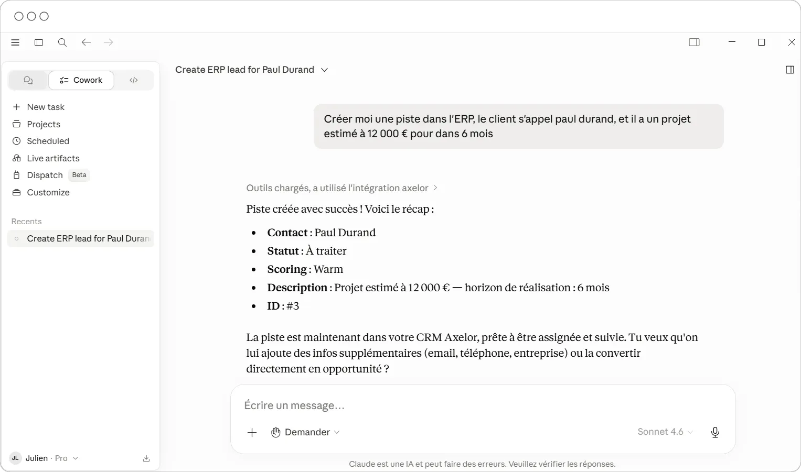
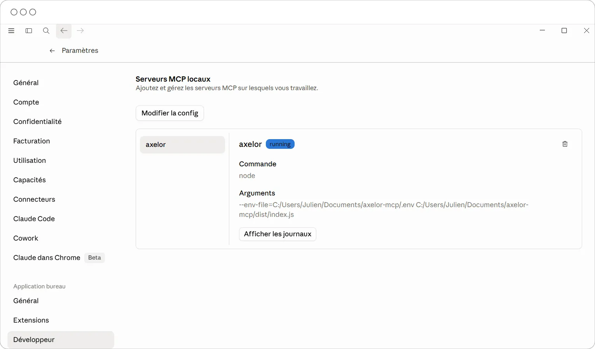

# Axelor MCP - Connecteur Axelor pour Claude

Ce projet permet à Claude d'interroger directement votre instance Axelor : rechercher des partenaires, consulter et créer des commandes clients, etc.

## Aperçu





## Table des matières

- [Installation Windows](#installation-windows)
- [Mise à jour](#mise-à-jour)
- [Outils disponibles](#outils-disponibles)

---

## Installation Windows

### 1. Installer Node.js et Git

Télécharger et installer **Node.js v24 LTS** → [nodejs.org](https://nodejs.org/en/download) (choisir « Windows Installer »).

Télécharger et installer **Git** → [git-scm.com](https://git-scm.com/download/win).

Vérifier les installations dans un terminal :

```bash
node --version
git --version
```

### 2. Télécharger le projet

Ouvrir un terminal et cloner le dépôt dans `C:\Users\<NomUtilisateur>\Documents\axelor-mcp` :

```bash
git clone https://github.com/JulienLach/axelor-mcp C:\Users\<NomUtilisateur>\Documents\axelor-mcp
cd C:\Users\<NomUtilisateur>\Documents\axelor-mcp
```

Dans le terminal, installer les dépendances puis compiler le projet :

```bash
npm install
npm run build
```

### 3. Créer le fichier de configuration

Créer un fichier `.env` à la racine du projet :

```bash
nano .env
```

```env
AXELOR_BASE_URL=https://instance-client.axelor.com
AXELOR_USERNAME=identifiant_client
AXELOR_PASSWORD=mot_de_passe_client
```

### 4. Connecter à Claude Desktop

Dans Claude Desktop, ouvrir **Paramètres → Développeur → Modifier la configuration**. Cela ouvre directement le fichier de configuration.

Y ajouter le bloc suivant en remplaçant `<NomUtilisateur>` par le nom de votre utilisateur Windows :

```json
{
    "mcpServers": {
        "axelor": {
            "command": "node",
            "args": [
                "--env-file=C:/Users/<NomUtilisateur>/Documents/axelor-mcp/.env",
                "C:/Users/<NomUtilisateur>/Documents/axelor-mcp/dist/index.js"
            ]
        }
    }
}
```

Fermer complètement Claude Desktop (clic droit sur l'icône dans la barre des tâches → quitter), puis le redémarrer. Le serveur MCP Axelor devrait se lancer automatiquement.

---

## Mise à jour

Claude Desktop exécute la version compilée du projet (`dist/index.js`). Pour récupérer une nouvelle version, il faut donc télécharger les modifications **puis** recompiler.

Ouvrir un terminal dans le dossier du projet :

```bash
cd C:\Users\<NomUtilisateur>\Documents\axelor-mcp
git pull origin main
npm install
npm run build
```

- `git pull origin main` récupère la dernière version du code depuis GitHub.
- `npm install` met à jour les dépendances si elles ont changé (sans effet sinon).
- `npm run build` recompile le projet dans le dossier `dist/`.

Le fichier `.env` n'est pas versionné : il est conservé tel quel lors de la mise à jour.

Fermer complètement Claude Desktop (clic droit sur l'icône dans la barre des tâches → quitter), puis le redémarrer pour charger la nouvelle version.

---

## Outils disponibles

Une fois connecté, vous pouvez faire vos demandes en langage naturel, le MCP va les interpréter. Exemples :

> Les outils de création (`create_*`) affichent d'abord un aperçu : rien n'est créé dans Axelor tant que vous n'avez pas confirmé.

**Partenaires**

- `search_partners` — _"Recherche le client Dupont dans Axelor"_
- `get_partner` — _"Montre-moi toutes les infos sur le partenaire Dupont"_

**Produits**

- `search_products` — _"Trouve le produit Prestation de conseil dans le catalogue"_

**Commandes clients**

- `search_sale_orders` — _"Commandes confirmées non facturées du client Dupont depuis janvier 2025"_, _"Commandes confirmées pas encore livrées"_ (filtres : client, numéro, référence client, statut, facturation, livraison, période de confirmation, pagination)
- `get_sale_order` — _"Donne-moi le détail complet de la commande SO-00042"_
- `create_sale_order` — _"Crée un devis pour le client Dupont avec 2 jours de prestation"_

**Factures**

- `search_invoices` — _"Factures impayées du client Dupont"_, _"Factures émises en janvier 2026"_, _"Avoirs clients du trimestre"_ (filtres : client, numéro, statut, type, période, échéance, unpaidOnly)
- `get_invoice` — _"Montre-moi le détail de la facture FAC-00123"_
- `analyze_invoices` — _"CA facturé net par équipe ce mois-ci"_, _"Tendance mensuelle de la facturation sur l'exercice"_ (groupBy : month / client / team / status ; factures - avoirs ; filtres : période, statut, client, équipe, client/fournisseur)

**Écritures comptables**

- `search_move_lines` — _"Les impayés du mois en cours"_, _"Lignes non lettrées du client Dupont sur le compte 411000"_ (lecture seule ; filtres : partenaire, compte, journal, période, unpaidOnly — défaut : mois en cours, non soldé)

**Analyse des ventes**

- `analyze_sales` — _"Tendance mensuelle de mon CA sur les 3 derniers mois"_, _"Top clients par CA sur 2025"_, _"Performance par commercial ce trimestre"_, _"Devis et commandes par équipe ce mois-ci"_ (groupBy : month / client / salesperson / team / status ; filtres : période, statut, client, commercial, équipe)
- `analyze_products` — _"Top 15 produits par CA sur le dernier trimestre"_, _"Ventes par famille de produits sur le premier semestre 2026"_ (groupBy : product / family / category ; période obligatoire ; filtres : client, topN)

**Opportunités CRM**

- `search_opportunities` — _"Liste les opportunités du client Dupont"_, _"Opportunités suivies par Marie"_ (filtres : nom, client, responsable, archivé)
- `get_opportunity` — _"Détails de l'opportunité Structure métallique Tuyauterie & Caux"_
- `create_opportunity` — _"Crée une opportunité de 15 000 € pour le prospect Martin avec 60 % de probabilité"_
- `analyze_opportunities` — _"État du pipeline par étape de vente"_, _"Pipeline pondéré par commercial pour les closings du trimestre"_, _"Quelles sources apportent le plus d'opportunités ?"_ (groupBy : status / salesperson / source / month ; montant total et pondéré par la probabilité ; filtres : période de closing prévue, client, commercial)

**Pistes CRM**

- `search_leads` — _"Montre-moi les pistes chaudes non converties assignées à Julien"_
- `get_lead` — _"Détails de la piste Jean Dupont chez ABC"_
- `create_lead` — _"Crée une piste pour Jean Dupont de la société ABC, email jean@abc.fr"_

**Projets**

- `search_projects` — _"Liste les projets ouverts du client Dupont"_, _"Projets en retard assignés à Marie"_ (filtres : client, responsable, statut, isOverdue, isBusinessProject, pagination)
- `analyze_projects` — _"Consommé vs vendu par client sur les projets commerciaux"_, _"Charge par responsable avec projets en retard"_, _"Répartition par statut des projets commerciaux"_ (groupBy : client / assignedTo / status ; filtres : client, responsable, retard, projets commerciaux)
- `get_project_tasks_summary` — _"Fais-moi la synthèse des tâches de l'affaire Refonte site web"_, _"Quelles tâches sont sans responsable sur ce projet ?"_ (répartition par statut et par responsable, tâches en retard, avancement global, heures estimées vs consommées ; possibilité d'exclure les statuts terminés)

**Feuilles de temps**

- `search_timesheets` — _"Feuilles de temps en attente de validation"_, _"Feuilles de temps de Dupont sur janvier 2026"_ (filtres : employé, statut, période)
- `get_timesheet` — _"Montre-moi le détail de la feuille de temps de Dupont avec toutes ses lignes"_
- `summary_timesheet_by_project` — _"Temps passé par projet cette semaine"_, _"Heures imputées par employé en mars 2026"_, _"Récap du temps passé par projet sur le projet X en février"_ (groupBy : project / employee ; filtres : période obligatoire, employé, projet)

**Postes à pourvoir (RH)**

- `search_job_positions` — _"Liste les postes ouverts"_, _"Postes en attente dans le département Commercial"_, _"Offres publiées chez Axelor SAS"_ (filtres : intitulé, statut, société, département, type de contrat, archivé)
- `get_job_position` — _"Détails complets du poste ID 42"_
- `create_job_position` — _"Crée un poste de Développeur Java, expérience 2-5 ans, salaire 45 000 €, à pourvoir le 1er juin"_

**Anomalies / Debug**

- `search_tracebacks` — _"Montre-moi les erreurs bloquantes de la semaine"_, _"Anomalies sur le module de facturation depuis lundi"_ (filtres : période, catégorie non_bloquant/bloquant/fonctionnel, origine, exception, utilisateur, archivé)
- `get_traceback` — _"Analyse technique de cette anomalie"_ — chaîne d'exceptions, frames applicatifs isolés (bruit framework filtré), premier point d'entrée probable du bug ; option `showFullTrace` pour la stack brute complète
- `analyze_tracebacks` — _"Quelles sont les erreurs les plus fréquentes ce mois-ci ?"_, _"Y a-t-il une régression sur le module de vente ?"_ — top exceptions par fréquence, top modules/origines touchés, tendance par jour sur 14 jours (⚠ erreurs bloquantes mises en évidence)
